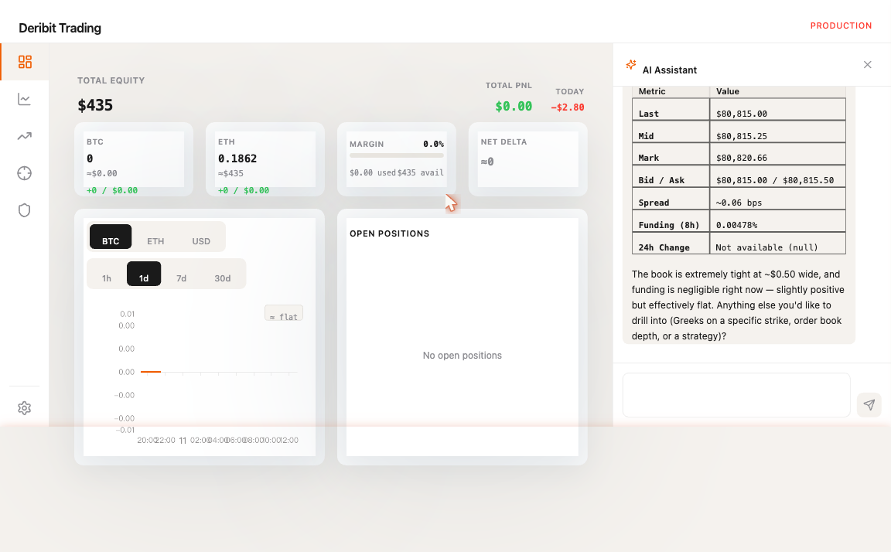
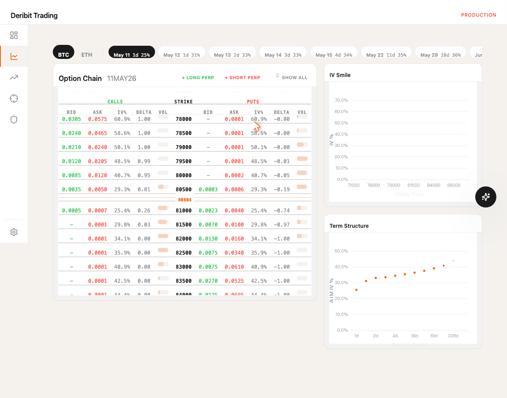
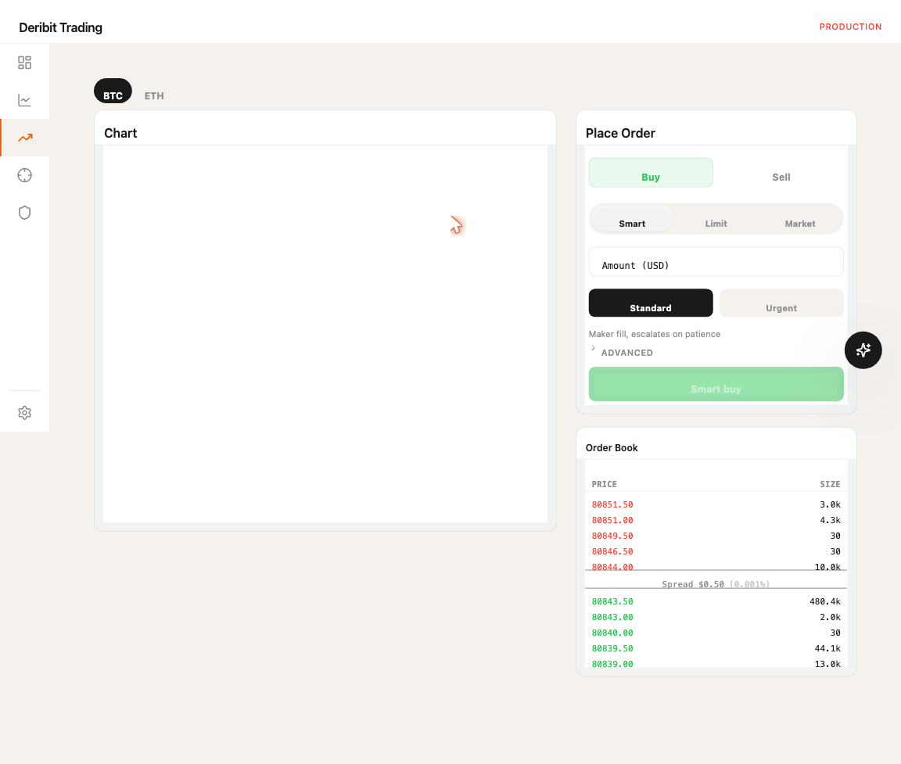
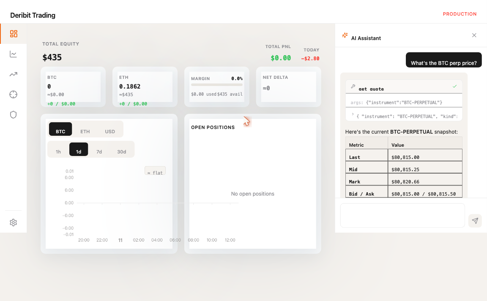
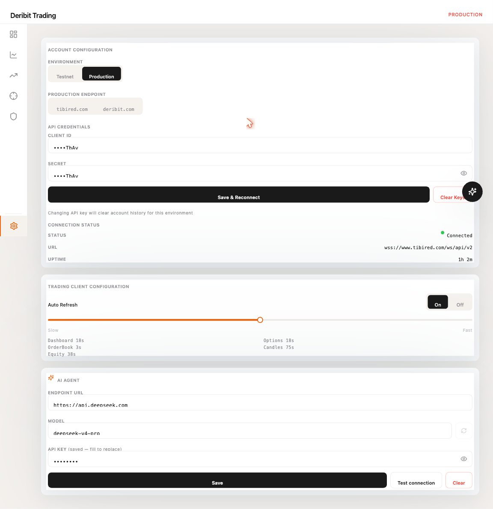

# Deribit Trading Agent

A personal **derivatives trading terminal** for Deribit with a built-in **AI assistant** that streams answers about live markets, your portfolio, and option strategies — without ever placing an order on your behalf.



---

## Who is this for?

| You are… | What you'll get |
| --- | --- |
| **A discretionary derivatives trader** | A clean Deribit UI with live perp/options/futures data, smart-order execution algos (tick-chaser, intent router), portfolio + risk dashboards, and an LLM you can ask "show me the BTC option market" instead of clicking through tabs. |
| **An AI engineer / agent designer** | A worked example of *progressive disclosure* in MCP tool design: 12 atomic read-only data tools + 1 compute tool, type-adaptive returns, slim system prompt (~800 tokens), and SSE streaming protocol that the frontend renders incrementally. Browse `src/deribit_trading/agent/` and `src/deribit_trading/mcp_server.py` for the full implementation. |
| **A derivatives beginner** | A safe playground to read live Greeks / IV / funding rates, simulate multi-leg payoffs (straddles, condors, covered calls) with the `analyze_option_combo` tool, and ask the AI to explain instruments and strategies in plain language. |

---

## What it does

### Trading terminal (frontend)
- **Live multi-instrument dashboard**: BTC + ETH perps, futures, full option chain with Greeks, IV surface, equity curve.
- **Smart orders**: tick-chaser and intent-router algorithms with maker-preferred execution and patience controls.
- **Portfolio + risk views**: positions, P&L attribution, daily-loss limits, margin ratios.
- **Settings**: per-environment credential store (Fernet-encrypted), production / testnet switch, auto-refresh tuning.

**Option chain — IV smile + term structure side by side:**



**Futures — chart, smart-order panel, live order book:**



### AI assistant (right-side chat)
- **Read-only Phase 1**: cannot place, cancel, or modify orders.
- **OpenAI-compatible LLM**: defaults to DeepSeek; works with Zhipu GLM, OpenAI, vLLM, ollama, anything OpenAI-API-compatible.
- **13 atomic MCP tools**:
  - Discovery — `list_instruments`, `list_expiries`
  - Single-instrument — `get_quote` (type-adaptive: perp / option / future), `get_orderbook`, `get_candles`
  - Batch — `get_market_snapshot` (one ~200ms RTT for the entire option chain)
  - Account — `get_positions`, `get_balance`, `get_pnl_breakdown`, `get_risk_status`
  - System — `get_system_status`
  - Compute — `analyze_option_combo` (multi-leg payoff curve + aggregate Greeks)
- **SSE streaming**: text deltas, tool-use lifecycle events, tool results, terminal/error events — frontend renders each chunk live.

**Each tool call renders as an inline card you can expand to inspect args + raw JSON output:**



---

## Stack

| Layer | Tech |
| --- | --- |
| Trading core | Python 3.12, `asyncio`, `pydantic`, `websockets`, Deribit JSON-RPC v2 |
| Persistence | SQLite (`aiosqlite`), bucketed equity snapshots, candle cache |
| REST API | FastAPI + SSE streaming |
| MCP | Python `mcp` SDK |
| LLM client | `openai` SDK (any OpenAI-compatible endpoint) |
| Frontend | React 18, TypeScript, Vite, Tailwind, Zustand, Radix UI, ECharts |
| Testing | `pytest`, `vitest` |

---

## Quick start

```bash
# 1. Backend
uv sync
export DEEPSEEK_API_KEY=sk-...      # any OpenAI-compatible endpoint works
uv run python -m deribit_trading api --env testnet --host 127.0.0.1 --port 8000

# 2. Frontend
cd frontend
npm install
npm run dev                          # http://localhost:5173

# 3. Configure Deribit credentials in Settings → Account Configuration
# 4. Open the chat sidebar (FAB, bottom-right) → ask "What's the BTC perp price?"
```

Deribit testnet is recommended for first run. The production switch requires explicit confirmation in Settings.



---

## Project philosophy

A few opinions baked into the design — worth knowing if you're reading the code:

- **Atomic data plane, not API wrappers.** Each MCP tool is a *minimal data unit*. Complex analysis (IV skew, term structure, payoff sweeps) belongs in a future Skill layer that *composes* these tools — keeping the agent surface thin and the LLM in charge of reasoning over raw arrays.
- **Just-in-time disclosure.** Tier 1 knowledge (~800 tokens) only covers what the agent *must know to use the tools*. Specifics like current fee schedules or smart-order internals are fetched on demand via `get_system_status`, not preloaded into every prompt.
- **No "interpretation" fields in MCP responses.** Tools return numbers; the LLM (or a future Skill module) decides what they mean. No `"shape": "contango"` magic strings.
- **No hidden caching.** All tool calls hit Deribit live. The batch endpoint (`public/get_book_summary_by_currency`) is ~200ms — caching's complexity isn't worth it.
- **Refuse price direction predictions and direct buy/sell calls.** The agent presents tradeoffs, payoffs, and risks — not "BTC will go up."

---

## Status

- **Phase 1 (current)**: read-only AI assistant + full trading UI. Write tools (`place_order`, `cancel_order`, `smart_order`, etc.) are wired in the backend but disabled at the agent layer.
- **Future**: Skill layer (Python analytics modules — IV skew, term structure, IV-RV), Phase 3 confirmation-card flow for order execution, Tier 2 strategy playbook.

---

## License

[MIT](./LICENSE) — do what you want, but don't blame me if you lose money. This is a research tool, not investment advice.

---

## Acknowledgements

Built with [Claude Code](https://claude.com/claude-code) as a pair-programming partner, including the OpenSpec-style change planning workflow.
